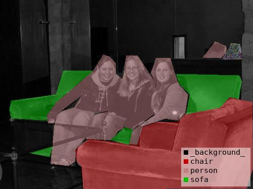
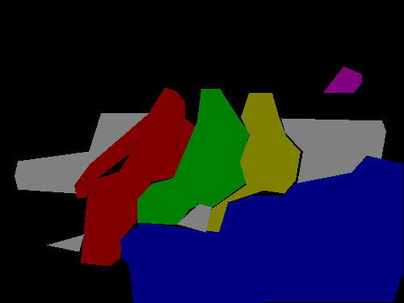
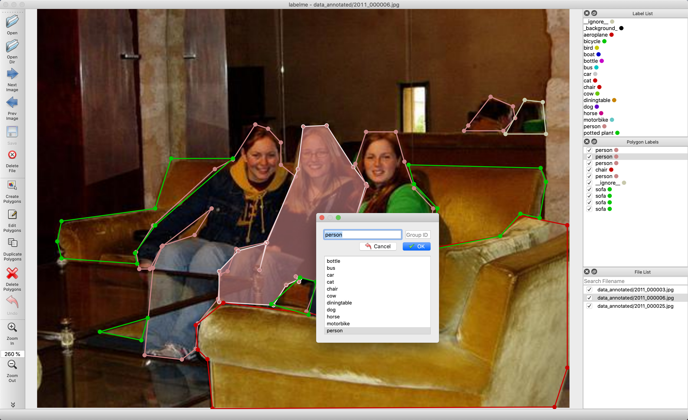
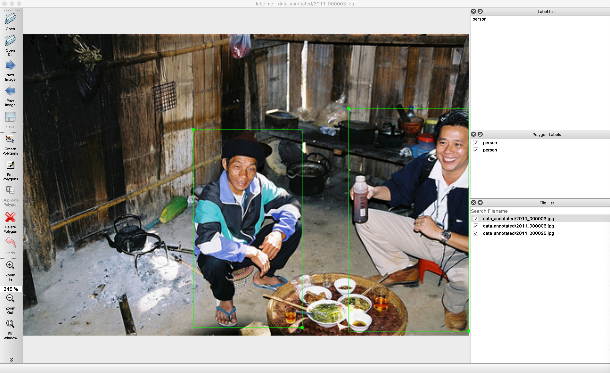

<h1 align="center">
  <br/>LSAnnotation
</h1>

<h4 align="center">
  使用 Python 的图像多边形注释
</h4>

<div align="center">
  <a href="https://pypi.python.org/pypi/labelme"></a>
  <a href="https://pypi.org/project/labelme"></a>
  <a href="https://github.com/wkentaro/labelme/actions"></a>
</div>

<div align="center">
  <a href="#starter-guide"><b>入门指南</b></a>
  | <a href="#installation"><b>安装</b></a>
  | <a href="#usage"><b>用法</b></a>
  | <a href="#examples"><b>示例</b></a>
  | <a href="https://x.com/labelmeai"><b>X/Twitter</b></a>
  <!-- | <a href="https://github.com/wkentaro/labelme/discussions"><b>Community</b></a> -->
  <!-- | <a href="https://www.youtube.com/playlist?list=PLI6LvFw0iflh3o33YYnVIfOpaO0hc5Dzw"><b>Youtube FAQ</b></a> -->
</div>

<br/>

<div align="center">
  
</div>

## Description

Labelme 是一个受 <http://labelme.csail.mit.edu> 启发的图形图像注释工具。
它是用 Python 编写的，并使用 Qt 作为其图形界面。

      
<i>实例分割的 VOC 数据集示例。</i>

    
<i>其他示例（语义分割、bbox 检测和分类）。</i>

    
<i>各种基元（多边形、矩形、圆形、直线和点）。</i>


## 功能

- [x] 多边形、矩形、圆形、线和点的图像注释。 ([教程](examples/tutorial))
- [x] 用于分类和清理的图像标志注释。 ([#166](https://github.com/wkentaro/labelme/pull/166))
- [x] 视频注释。 ([视频注释](examples/video_annotation))
- [x] GUI 自定义（预定义的标签/标志、自动保存、标签验证等）。 ([#144](https://github.com/wkentaro/labelme/pull/144))
- [x] 导出 VOC 格式数据集以进行语义/实例分割。 ([semantic segmentation](examples/semantic_segmentation), [instance segmentation](examples/instance_segmentation))
- [x] 导出 COCO 格式数据集以进行实例分割。 ([instance segmentation](examples/instance_segmentation))


## 入门指南

如果您不熟悉 Labelme，可以开始使用 [Labelme 入门指南](https://labelme.gumroad.com/l/starter-guide) (免费), 其中包含：

- **适用于所有平台的安装指南：**  Windows, macOS, and Linux 💻
- **分步教程**: 从第一个注释到编辑、导出和与其他程序 📕 集成
- **为进一步探索** 🔗 而收集的宝贵资源。


## 安装

 有以下选项：

- 与平台无关的安装: [Anaconda](#anaconda)
- 特定于平台的安装: [Ubuntu](#ubuntu), [macOS](#macos), [Windows](#windows)
- 发布部分中的预生成二进制文件 [the release section](https://github.com/wkentaro/labelme/releases)

### Anaconda

您需要安装 [Anaconda](https://www.continuum.io/downloads), 然后运行以下内容：

```bash
# python3
conda create --name=labelme python=3
source activate labelme
# conda install -c conda-forge pyside2
# conda install pyqt
# pip install pyqt5  # pyqt5 can be installed via pip on python3
pip install labelme
# or you can install everything by conda command
# conda install labelme -c conda-forge
```

### Ubuntu

```bash
sudo apt-get install labelme

# or
sudo pip3 install labelme

# or install standalone executable from:
# https://github.com/wkentaro/labelme/releases
```

### macOS

```bash
brew install pyqt  # maybe pyqt5
pip install labelme

# or
brew install wkentaro/labelme/labelme  # command line interface
# brew install --cask wkentaro/labelme/labelme  # app

# or install standalone executable/app from:
# https://github.com/wkentaro/labelme/releases
```

### Windows

安装 [Anaconda](https://www.continuum.io/downloads), 然后在 Anaconda 提示符中运行：

```bash
conda create --name=labelme python=3
conda activate labelme
pip install labelme

# or install standalone executable/app from:
# https://github.com/wkentaro/labelme/releases
```


## 用法

运行 `labelme --help` 以获取详细信息。 
注释将另存为 [JSON](http://www.json.org/) 文件。

```bash
labelme  # just open gui

# tutorial (single image example)
cd examples/tutorial
labelme apc2016_obj3.jpg  # specify image file
labelme apc2016_obj3.jpg -O apc2016_obj3.json  # close window after the save
labelme apc2016_obj3.jpg --nodata  # not include image data but relative image path in JSON file
labelme apc2016_obj3.jpg \
  --labels highland_6539_self_stick_notes,mead_index_cards,kong_air_dog_squeakair_tennis_ball  # specify label list

# semantic segmentation example
cd examples/semantic_segmentation
labelme data_annotated/  # Open directory to annotate all images in it
labelme data_annotated/ --labels labels.txt  # specify label list with a file
```

### 命令行参数
- `--output` 指定将写入批注的位置。如果位置以 .json 结尾，则单个批注将写入此文件。如果用 .json 指定位置，则只能对一个图像进行注释。如果该位置不以 .json 结尾，则程序将假定它是一个目录。批注将存储在此目录中，其名称与进行批注的图像相对应。
- 第一次运行 labelme 时，它会在 `~/.labelmerc`中创建一个配置文件。您可以编辑此文件，更改将在您下次启动 labelme 时应用。如果您希望使用其他位置的配置文件，则可以使用 `--config` 标志指定此文件。
- 如果没有标志 `--nosortlabels` ，程序将按字母顺序列出标签。当程序使用此标志运行时，它将按提供的顺序显示标签。
- 标志将分配给整个映像。 [示例](examples/classification)
- 标注将分配给单个多边形。 [示例](examples/bbox_detection)

### 常见问题

- **如何将JSON文件转换为numpy数组？** 请参阅 [示例/教程](examples/tutorial#convert-to-dataset).
- **如何加载标签PNG文件？** 请参阅 [示例/教程](examples/tutorial#how-to-load-label-png-file).
- **如何获取语义分割的注释？** 请参阅 [示例/semantic_segmentation](examples/semantic_segmentation).
- **如何获取实例分割的注解？** 请参阅 [示例/instance_segmentation](examples/instance_segmentation).


## 示例

* [图像分类](examples/classification)
* [边界框检测](examples/bbox_detection)
* [语义分割](examples/semantic_segmentation)
* [实例细分](examples/instance_segmentation)
* [视频注释](examples/video_annotation)

## 如何开发

```bash
git clone https://github.com/wkentaro/labelme.git
cd labelme

# Install anaconda3 and labelme
curl -L https://github.com/wkentaro/dotfiles/raw/main/local/bin/install_anaconda3.sh | bash -s .
source .anaconda3/bin/activate
pip install -e .
```


### 如何构建独立的可执行文件

下面显示了如何在 macOS、Linux 和 Windows 上构建独立的可执行文件。 

```bash
# Setup conda
conda create --name labelme python=3.9
conda activate labelme

# Build the standalone executable
pip install .
pip install 'matplotlib<3.3'
pip install pyinstaller
pyinstaller labelme.spec
dist/labelme --version
```


### 如何贡献

请确保以下测试在您的环境中通过。 
有关详细信息，请参阅 `.github/workflows/ci.yml` 。

```bash
pip install -r requirements-dev.txt

ruff format --check  # `ruff format` to auto-fix
ruff check  # `ruff check --fix` to auto-fix
MPLBACKEND='agg' pytest -vsx tests/
```


## 确认

这个 repo 是 [mpitid/pylabelme](https://github.com/mpitid/pylabelme) 的分支。
